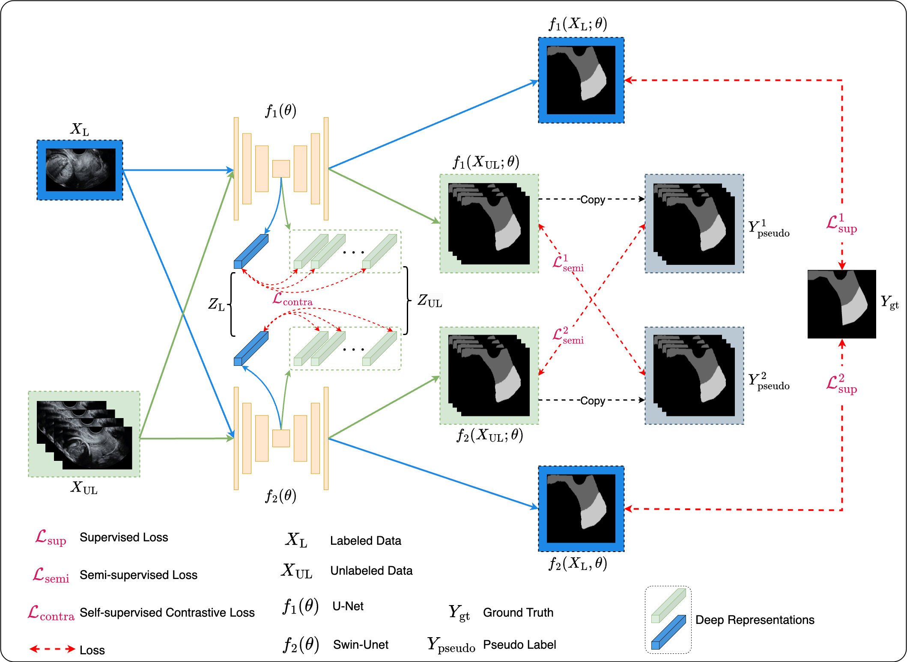
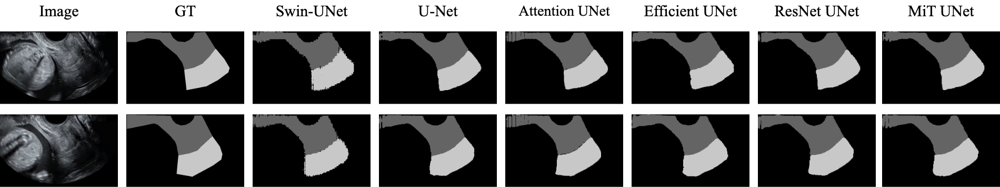

# Semi-supervised Cervical Segmentation on Ultrasound by A Dual Framework for Neural Networks

This is the official implementation for the paper Fangyijie Wang et al., "Semi-supervised Cervical Segmentation on Ultrasound by A Dual Framework for Neural Networks". 

This paper was accepted for oral presentation on [ISBI 2025](https://biomedicalimaging.org/2025/) Fetal Ultrasound Grand Challenge: [Semi-Supervised Cervical Segmentation](https://www.codabench.org/competitions/4781/)



## Run Test

* UNet + UNet
```sh
python train_semi_unet_unet.py --root_path /root_dir --exp Fetal/Semi_Unet_Unet --model unet --max_iterations 30000 --labeled_bs 2 --labeled_num 100 --batch_size 8 --num_classes 3
```

* UNet + Attention UNet
```sh
python train_semi_unet_attunet.py --root_path /root_dir --exp Fetal/Semi_Unet_attunet --model attunet --max_iterations 30000 --labeled_bs 2 --labeled_num 100 --batch_size 8 --num_classes 3
```

* UNet + Efficient-UNet
```sh
python train_semi_unet_effunet.py --root_path /root_dir --exp Fetal/Semi_unet_effunet --model EffiUnet --max_iterations 30000 --labeled_bs 2 --labeled_num 100 --batch_size 8 --num_classes 3
```

* UNet + ResNet-UNet
```sh
python train_semi_unet_resunet.py --root_path /root_dir --exp Fetal/Semi_unet_resunet --model ResUnet --max_iterations 30000 --labeled_bs 2 --labeled_num 100 --batch_size 8 --num_classes 3
```

* UNet + MiT-UNet
```sh
python train_semi_unet_mitunet.py --root_path /root_dir --exp Fetal/Semi_unet_mitunet --model MitUnet --max_iterations 30000 --labeled_bs 2 --labeled_num 100 --batch_size 8 --num_classes 3
```

## Evaluation

Figure 1. Visualization results of different neural networks on our validation dataset.


Table 1. Quantitative results of different neural networks on the external validation dataset.
| $f_1(\theta)$ | $f_2(\theta)$ | DSC ↑ | HD ↓  | Time ↓ |
|-------------------|---------------------|------|------|-------|
| U-Net           | U-Net               | 0.76 | 63.99 |  5.65  |
| U-Net           | Attention U-Net      | 0.78 | 78.68 |  8.89  |
| U-Net           | Efficient-Unet       | 0.84 | 60.52 | 74.62  |
| U-Net           | ResNet-Unet          | 0.82 | 69.94 |  7.79  |
| U-Net           | MiT-Unet             | 0.82 | 62.88 |  7.04  |
| **U-Net**       | **Swin-Unet**        | **0.86** | **46.44** | **16.95** |

## Acknowledge

This code is mainly based on 
[Semi Mamba UNet](https://github.com/ziyangwang007/Mamba-UNet/blob/main/code/train_Semi_Mamba_UNet.py), [SegFormer](https://github.com/NVlabs/SegFormer), [Segmentation Models](https://github.com/qubvel-org/segmentation_models.pytorch), [SwinUNet](https://github.com/HuCaoFighting/Swin-Unet).
Thanks for their contributions.
